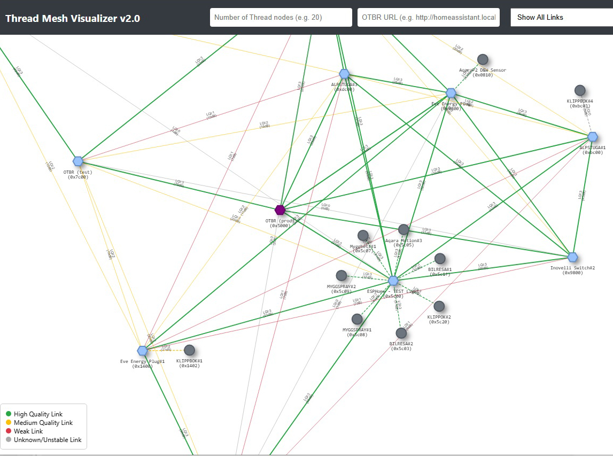

# Thread Mesh Visualizer

A web-based tool to visualize OpenThread network topology in real-time. It communicates with an OpenThread Border Router (OTBR) using its REST API to crawl the network, map connections between routers and end devices, and display link quality using a physics-based graph layout.  For more information on the Open Thread Border Router REST API, go to [https://github.com/openthread/ot-br-posix](https://github.com/openthread/ot-br-posix) and navigate to /src/rest/README file.</br>

This Thread Mesh Visualizer is targeted towards Home Assistant and its OTBR App/AddOn.

<caption><b>Thread Mesh Visualizer</b></caption>



## Features

*   **Iterative Crawl**: Starts from the Border Router and discovers neighbors hop-by-hop using the OTBR REST API (JSON:API).
*   **Physics Logic**: Link lengths are calculated using an Inverse Square Law based on signal strength (Link Margin or RSSI), providing a realistic spatial representation of the mesh.
*   **Link Filtering**: Toggle visibility of weak/medium links. Hidden links stop affecting the physics simulation, allowing the graph to relax.
*   **Device Naming**: Map Extended Addresses to friendly names via a JSON configuration file.
*   **Detailed Inspection**: Click nodes to see highlights about the node as well as raw diagnostic data.
*   **Export**: Save the current topology architecture to JSON.

## Prerequisites

1.  **OpenThread Border Router (OTBR)**: You need an active OTBR with the Web GUI/REST API enabled (usually on port 80 or 8081).
2.  **Network Access**: The machine running this visualizer must be able to reach the OTBR's IP address.

## Installation & Usage

You can run this as a static web page. No build process is required (Vanilla JS + CSS).

### Run Locally (Ex. Python Server)

1.  Clone this repository (or simply copy the files: `index.html`, `app.js`, `style.css`, and `device_names.json`) to a machine that can serve up a webpage.
2.  Start a simple HTTP server that uses the files in the folder.  One way to do this is simply startup a python server as:
    ```bash
    python3 -m http.server 8000
    ```
3.  Open `http://NAME-ADDRESS-OF-YOUR-MACHINE:8000` in your browser to bring up the Thread Mesh Visualizer webpage

## How to Use

### Discovery
1.  Enter the number of Thread nodes that are in your Thread network.  This doesn't have to be exact, but should be close.  This helps the Collection Task know how many devices is should be querying for without timing out. _Sometimes this number is not needed at all, particularly after the Collector has run a few times._
2.  Enter your OTBR URL, for example: `http://192.168.1.50:8081`, or for example with HAOS and its OTBR: `http://homeassistant.local:8081`, and click **Start Crawl**.
3.  Click **"Start Crawl"**.
4.  The tool will:
    *   Have the OTBR Run a Collection Task which has the OTBR collect diagnostic data from the router nodes. _This can be quick or can take a few minutes._
    *   Queries the Border Router to discover its Extended Address.
    *   Start issuing Diagnostic commands beginning with the connected OTBR to learn about it and its neighbors.
    *   Continue collecting diagnostic data for each neighbor, and then their neighbors until all routers have been discovered
    *   The diagnostic data for each router will contain data about its attached children.
    *   Starts drawing the graph as diagnostic data is collected for each router and their attached children.
    *   A Log window is provided to highlight the progress.


### Controls
*   **Link Filter**: Use the dropdown to hide weak links. This also disables their physics forces, which helps declutter dense meshes.
*   **Export JSON**: Downloads the current `vis.DataSet` content for backup.
*   **Import JSON** (FUTURE): A possible feature to be used in the future which will allow one to import a previously exported JSON file in order to visualize what the Thread network looked like at that time.

## Configuration

### Friendly Names
The file `device_names.json` is used to map Extended MAC Addresses to readable names.  It is of JSON format with a list of key:value pairs each separated by a comma (except the last entry) where the key is the extended Address, and the value is the text string that will be shown on the graph.  For example:

```json
{
    "b2c9a2836317bc63": "Border Router (Pi)",
    "f4ce368a0s......": "Living Room Sensor"
}
```
Finding out the device's Extended MAC address can be a bit difficult: For Home Assistant, if you are using its Matter Integration, the best way to find the Extended MAC address is to go to the Device Page for the Matter over Thread device of interest and look at its "Matter info" where it provides the Extended MAC address and it also provides the device's name that can be used.  Be aware that some Thread devices tell the Matter Server of its Extended MAC address, but actually uses another Extended MAC address on the Thread network.  If this is the case, one way to figure this out is to compare the IPv6 address shown in the Matter Device page with the one found through this Thread Visualizer and if the IPv6 addresses match, then use the Extended Address shown in the Thread Visualizer.

## Troubleshooting
*   **"Update Device Collection Task Failed to Complete"**.  This is where you may have to play around with the "number of Thread nodes" input.
*   **"Failed to get data"**: Check the browser console (F12). 
*   **Nodes bunching up**: Try filtering out weak links using the dropdown.

## History
* Version 2.0 - The first release after highly modifying the original code from fpb.
  
## Credits
Fernando Birra (fpb) at [https://github.com/fpb/Thread-Network-Visualizer](https://github.com/fpb/Thread-Network-Visualizer) is the original developer of this.  This original code has since been highly modified.
